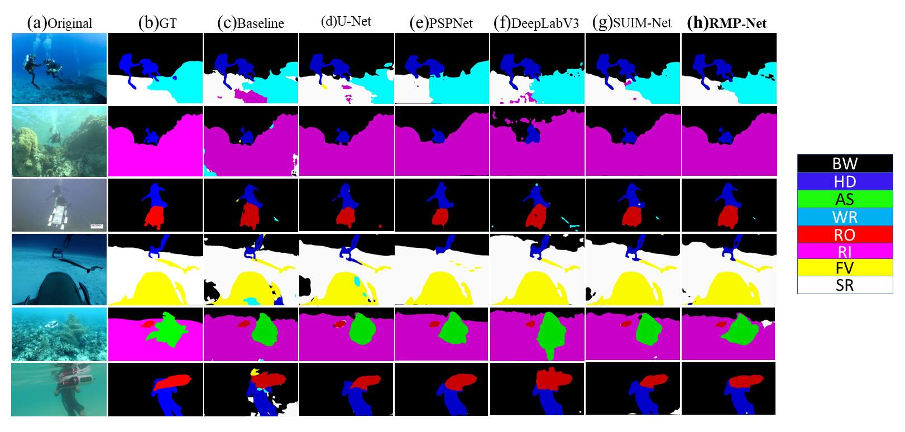

## RMP-Net: A structural reparameterization and sub-pixel super-resolution based Marine Scene Segmentation Network
---

## Reference
https://github.com/ggyyzm/pytorch_segmentation  
https://github.com/bonlime/keras-deeplab-v3-plus
